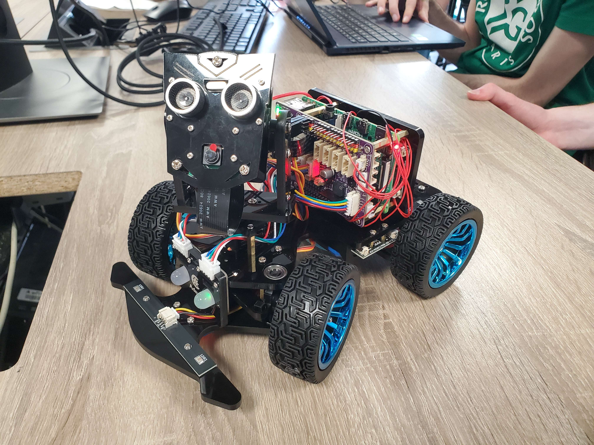

# Robot Wall-Ed

## Contexte

Dans le cadre du MasterCamp « Systèmes embarqués » de troisième année à l’EFREI, nous avons conçu ("allons concevoir") **Wall-Ed**, un robot autonome capable de se déplacer, de percevoir son environnement et d’interagir avec celui-ci.



Pour cette première partie, l’objectif était de mettre en place les fondations logicielles et matérielles : communication client-serveur et commande des capteurs (moteurs, servos, LEDs).

## Architecture générale

Le projet se compose de deux modules principaux :

1. **Backend**

   - Langage : Python
   - Framework : Flask (exposition d’une API RESTful)
   - Fonctionnalités : 
     - Contrôle des moteurs avec gestion d'accélération/décélération
     - Commande des servomoteurs (pan/tilt)
     - Gestion des LEDs RGB et WS2812
     - Acquisition vidéo en temps réel
     - Système radar avec scan automatique
     - Détection et suivi de ligne
     - Reconnaissance de couleurs et formes
     - Détection de flèches directionnelles
     - Mode police avec signalisation

2. **Frontend**

   - Langage : JavaScript
   - Framework : Vue.js
   - Fonctionnalités :
     - Interface web responsive pour pilotage manuel
     - Visualisation du flux vidéo en temps réel
     - Affichage des données radar
     - Contrôle des différents modes autonomes
     - Panneau de configuration avancé

## Structure du dépôt

```text
/.
├── backend/                     # Serveur Flask et logique robotique
│   ├── api/                     # Point d'entrée de l'application
│   │   └── routes/              # Définition des routes REST
│   ├── robot/                   # Implémentation de la classe Robot
│   │   ├── main.py              # Classe Robot principale
│   │   ├── config.py            # Configuration GPIO et I2C
│   │   ├── radar_processing.py  # Contrôleur radar et navigation
│   │   ├── line_tracking_processing.py  # Suivi de ligne
│   │   ├── camera_processing.py # Traitement vidéo et détection
│   │   └── color_detection.py   # Reconnaissance de couleurs
│   ├── sensors/                 # Modules capteurs
│   │   ├── ultrasonic.py        # Capteur de distance
│   │   ├── line_tracker.py      # Capteurs de ligne
│   │   ├── motor.py             # Contrôle moteurs
│   │   ├── servo.py             # Servomoteurs
│   │   ├── leds.py              # LEDs RGB
│   │   └── ws2812.py            # LEDs WS2812
│   ├── requirements.txt
│   └── run.py                   # Script de lancement
├── frontend/                    # Application Vue.js
│   ├── public/
│   ├── src/
│   │   ├── components/          # Composants Vue
│   │   └── views/               # Vues principales
│   ├── package.json
│   └── vite.config.js
└── run.sh                       # Script de lancement global
```

## Installation

1. **Backend**

   ```bash
   cd backend
   python3 -m venv venv
   source venv/bin/activate
   pip install -r requirements.txt
   ```

2. **Frontend**

   ```bash
   cd ../frontend
   npm install
   ```

## Exécution

1. **Démarrage du serveur backend**

   ```bash
   cd backend
   source venv/bin/activate
   python run.py
   ```

   Serveur backend : `http://localhost:5000`.

2. **Lancement de l’interface frontend**

   ```bash
   cd frontend
   npm run dev -- --host
   ```

   Serveur web : `http://localhost:5173`.

3. Grâce au script `run.sh`, démarrage des deux serveurs en une seule commande :

   ```bash
   ./run.sh
   ```


## Fonctionnalités implémentées

- 🎥 Caméra

   - Flux vidéo en temps réel via Picamera2
   - Détection de couleurs (rouge, vert, bleu, etc.)
   - Détection de flèches directionnelles

- 🤖 Navigation autonome

   - Système radar : Scan automatique 360° avec évitement d'obstacles
   - Suivi de ligne : Navigation autonome sur trajectoire prédéfinie
   - Évitement d'obstacles : Détection et contournement automatique

- 🎛️ Contrôle moteurs

   - Moteurs DC avec gestion d'accélération progressive
   - Servomoteurs pour mouvement de tête (pan/tilt)
   - Contrôle directionnel précis

- 💡 Système d'éclairage

   - Mode police avec clignotants
   - Feedback visuel selon l'état du robot

- 🔧 Contrôleurs avancés

   - RadarController : Gestion du scan radar et navigation
   - LineTrackingController : Suivi de ligne automatique
   - ColorDetectionController : Reconnaissance de couleurs
   - CameraController : Traitement vidéo temps réel

- 📡 Communication

    - API REST complète
    - WebSocket pour données temps réel
    - Interface web 
    - Contrôle à distance
